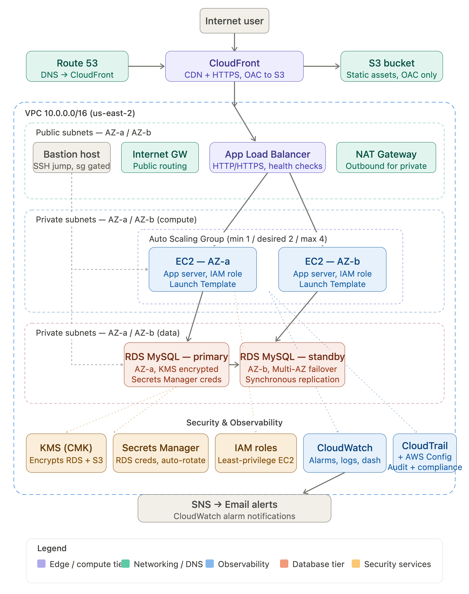

# Phase 2 Capstone — 3-Tier Web Application on AWS

> **Portfolio Project 1** | AWS Solutions Architect Associate track | June 2025

---

## What This Is

A production-grade 3-tier web application built entirely on AWS, demonstrating the core architecture pattern used by real engineering teams: a CDN edge layer, a load-balanced compute tier, and an encrypted managed database tier. The architecture prioritizes **security by default** (no credentials in code, encryption at rest and in transit, least-privilege IAM throughout), **operational visibility** (CloudWatch alarms, CloudTrail audit trail, AWS Config compliance rules), and **resilience** (Auto Scaling Group with self-healing, Multi-AZ RDS). Every AWS service used here is one a cloud engineer would encounter in a production environment on day one.

---

## Architecture Diagram



> **Flow:** User → CloudFront (OAC) → Application Load Balancer → EC2 Auto Scaling Group → RDS MySQL (Multi-AZ)

---

## AWS Components

| Service | Tier | Role in Architecture |
|---|---|---|
| **CloudFront** | Edge | CDN and HTTPS termination; Origin Access Control restricts S3 direct access |
| **S3** | Edge | Static asset storage; only accessible via CloudFront OAC, not public |
| **Application Load Balancer** | Web | HTTP/HTTPS load balancing across EC2 instances; health checks gate traffic |
| **EC2 (Auto Scaling Group)** | Application | App servers in private subnets; ASG maintains desired capacity and self-heals |
| **Launch Template** | Application | Defines EC2 configuration (AMI, instance type, IAM profile, user data) |
| **RDS MySQL** | Database | Managed relational DB in private subnet; Multi-AZ standby for HA |
| **VPC** | Networking | Isolated network (`10.0.0.0/16`); public subnets for ALB, private for EC2 + RDS |
| **Security Groups** | Networking | Stateful firewall rules — ALB accepts 443, EC2 accepts only from ALB SG, RDS accepts only from EC2 SG |
| **Route 53** | DNS | Public hosted zone routing traffic to CloudFront; private hosted zone for internal DB resolution |
| **KMS (CMK)** | Security | Customer-managed key encrypts RDS storage and S3 objects; separate from AWS-managed keys for auditability |
| **Secrets Manager** | Security | Stores RDS credentials; automatic rotation via Lambda; EC2 retrieves at runtime via IAM role |
| **IAM Roles** | Security | EC2 instance profile grants SSM access, Secrets Manager read, CloudWatch write — no static credentials |
| **CloudWatch** | Observability | Metrics, logs, alarms (CPU, memory, ALB 5xx errors, RDS connections); composite alarm for critical state |
| **CloudTrail** | Audit | Multi-region trail capturing all API calls; logs written to S3 with integrity validation |
| **AWS Config** | Compliance | 5 managed rules evaluating encryption, public access, MFA, and root account usage |
| **SNS** | Alerting | CloudWatch alarms publish to SNS topic; email notifications on threshold breach |

---

## Security Decisions

**Why KMS Customer-Managed Keys (CMK)?**
AWS-managed keys encrypt data but offer no control over key policy, rotation schedule, or cross-account access. A CMK lets you define exactly who can use the key (scoped to specific IAM roles), set your own rotation policy, and get a complete CloudTrail audit log of every encrypt/decrypt call. In regulated environments, CMKs are often a compliance requirement, not a choice.

**Why Secrets Manager (not environment variables or Parameter Store)?**
Hardcoded credentials are the most common cause of cloud security breaches. Secrets Manager solves three problems at once: it stores credentials outside the codebase, it makes them retrievable at runtime via IAM (no human ever sees them in plaintext), and it handles automatic rotation without redeploying the app. Parameter Store is a valid alternative for non-secret config, but Secrets Manager's native rotation support makes it the right choice for database credentials specifically.

**Why CloudFront Origin Access Control (OAC)?**
Without OAC, an S3 bucket serving a web app must be publicly accessible — anyone who discovers the bucket URL can bypass CloudFront entirely (bypassing WAF, logging, and caching). OAC locks the bucket so only the specific CloudFront distribution can read from it, enforced by S3 bucket policy. OAC replaces the older Origin Access Identity (OAI) approach and supports all S3 operations and SSE-KMS.

**Why least-privilege IAM roles on EC2?**
EC2 instances that run with broad permissions (or worse, with access keys in environment variables) become a lateral movement vector if compromised. The instance profile here grants only what the app needs: read from Secrets Manager, write logs to CloudWatch, and register with SSM for management access. If an instance is compromised, the blast radius is contained.

---

## Monitoring Decisions

**What's alarmed:**
- EC2 CPU utilization > 80% for 5 minutes → SNS alert (also triggers ASG scale-out)
- ALB HTTP 5xx error rate > 5% → SNS alert (application errors)
- RDS connections approaching limit → SNS alert (connection pool exhaustion)
- Composite alarm: CPU + 5xx errors both in ALARM state simultaneously → SNS critical alert

**What's logged:**
- Application logs → CloudWatch Log Group `/ec2/cloud-engineering` (7-day retention)
- All AWS API calls → CloudTrail multi-region trail → S3 with log file integrity validation
- ALB access logs → S3 (request-level visibility into traffic patterns)

**What's in Config:**
- `encrypted-volumes` — EBS volumes must be encrypted
- `rds-storage-encrypted` — RDS instances must use encryption at rest
- `s3-bucket-public-read-prohibited` — no S3 bucket may allow public read
- `root-account-mfa-enabled` — root account must have MFA
- `iam-root-access-key-check` — root account must not have active access keys

Alarms catch operational problems in real time. CloudTrail answers "who changed what and when" after the fact. Config answers "are we continuously compliant with our security baseline."

---

## Deployment Overview

> These steps assume AWS CLI configured with appropriate permissions and us-east-2 region.

**1. Networking**
```bash
# VPC, public/private subnets, IGW, NAT Gateway, route tables
# Security groups: ALB (443 inbound), EC2 (from ALB SG), RDS (from EC2 SG)
```

**2. Security baseline**
```bash
# KMS CMK creation
aws kms create-key --description "phase2-capstone-key"
# Secrets Manager — store RDS credentials before creating RDS
aws secretsmanager create-secret --name "prod/rds/credentials" --secret-string '{"username":"admin","password":"<generated>"}'
```

**3. Database**
```bash
# RDS MySQL Multi-AZ in private subnet group
# Encryption: CMK from step 2
# No public accessibility
```

**4. Compute**
```bash
# Launch Template with IAM instance profile, user data script
# Auto Scaling Group across 2 AZs, min=1 desired=2 max=4
# ALB with target group and health check path /health
```

**5. CDN + DNS**
```bash
# S3 bucket (block all public access)
# CloudFront distribution with OAC
# Route 53 A record → CloudFront
```

**6. Observability**
```bash
# CloudWatch alarms, dashboard, log group
# CloudTrail multi-region trail → S3
# AWS Config recorder + delivery channel + 5 managed rules
# SNS topic + email subscription
```

**Teardown order** (to avoid dependency errors):
CloudFront → ALB → ASG → EC2 → RDS (snapshot first) → NAT Gateway → KMS (schedule deletion) → Route 53 records

---

## Phase 2 Skills Demonstrated

- VPC design with public/private subnet isolation
- ALB + ASG for high availability and self-healing compute
- RDS Multi-AZ for managed database resilience
- CloudFront + S3 + OAC for secure static content delivery
- KMS CMK for encryption at rest (RDS, S3)
- Secrets Manager for zero-credential-in-code database access
- IAM least-privilege roles and instance profiles
- CloudWatch metrics, logs, alarms, composite alarms, dashboards
- CloudTrail multi-region audit trail
- AWS Config compliance rules
- Route 53 public + private hosted zones

---

*Part of a self-directed cloud engineering curriculum targeting AWS Solutions Architect Associate (SAA-C03) certification.*
